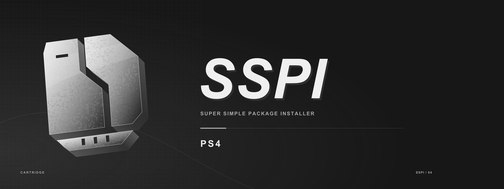

# SSPI PS4

**Super Simple Package Installer** is a controller-first package manager for homebrew-enabled PlayStation 4 consoles. Search a catalog, compare packages and mirrors, manage downloads, extract archives and install content from one interface.

**Current version: 5.10 beta** · C# / Mono · SDL2 · Native C/C++ services

This repository is the PS4 application. The [PS5 application](https://github.com/Xyhlo/SSPI-PS5) and [Windows Manager](https://github.com/Xyhlo/SSPI-Windows-Manager) have separate codebases.

## Features

- **Search by name or CUSA ID.** Browse regions, cover artwork and the installed library.
- **Compare package types.** Base games, updates, backports and DLC are grouped with versions, firmware requirements, sizes and mirrors when the source supplies them.
- **SuperPSX 2.0 integration.** The current local beta package includes the source descriptor and installs it on first launch. Search and resolution use a JSON API through the source engine.
- **Real-Debrid, TorBox and direct links.** Configure a service from your phone or use direct URLs. All source-provided mirrors remain visible; choosing a mirror does not guarantee that your service supports it.
- **Downloads grouped by game.** See progress, speed, remaining time and individual queued files. Pause, cancel or retry from the controller's contextual action row.
- **Archive handling.** Download ordered multipart archives, extract supported RAR/ZIP packages, and retain recoverable files when installation needs a retry.
- **PS4 installation support.** Use BGFT and the optional resident worker where the console supports them, with package validation and installed-content checks.
- **Local phone setup.** Scan the LAN QR code to manage connections and sources without typing long keys on the console.
- **Quiet interface audio.** Original ambient music, navigation sounds and installation-complete cues, with separate toggles and a volume control.

## Getting started

You need a PS4 that can run homebrew, network access, free storage for downloads and extraction, and a compatible local SSPI package. Debrid credentials are optional and belong to the service you choose.

1. Install the SSPI PKG using your console's package installer and launch it.
2. Open **Settings → Connections**. Scan the QR code with a phone on the same local network to configure Real-Debrid or TorBox, or select **Direct links**.
3. Open **Manage sources** and check that the source you want is enabled. SuperPSX 2.0 is bundled with the current local beta; existing choices to disable or remove it are preserved.
4. Search for a title, select the correct CUSA/region, then choose a package or mirror. Use **Queue recommended** when the available metadata is sufficient.
5. Follow progress in **Downloads**. Open **Files** to inspect the base package, update/backport and DLC individually.

Match updates and DLC to the installed game's title ID. A backport can be an alternative to an update, so inspect the package information before queuing both. Missing version or firmware data is shown as unknown rather than treated as a compatibility guarantee.

Existing settings and service keys are stored on the console under `/data/GameSearch`. Installing a new SSPI build keeps the same application and data-directory identity. No personal settings, credentials or download history are included in the distributed build inputs.

## Controls

The action row at the bottom of each screen shows the current bindings.

| Button | Action |
| --- | --- |
| D-pad | Move focus or adjust the selected value |
| Cross | Open, select or run the displayed action |
| Circle | Back or close |
| L1 / R1 | Switch main tabs or settings pages |
| Options | Open or close settings |
| Square | Context action, such as queue, cancel or remove |
| Triangle | Show mirrors where available |
| R2 | Context action, such as file details or update-version filtering |

**Settings → Sound** controls background music, interface sounds and volume. The default is 35%, with music mixed below the effects. Left/right adjusts volume in 5% steps; zero mutes it. Sound preferences save automatically.

## Beta status

The current work focuses on package resolution, reliable installation state, startup compatibility and a cleaner package-details screen.

- Package versions are distinguished from firmware numbers in source labels.
- Resolution errors and archive metadata survive caching, and unresolved candidates are excluded from automatic recommendations.
- Local package delivery supplies the reference metadata expected by BGFT. Installed-content checks help reconcile stale installation counters and false stalls.
- The transfer path coalesces small reads and uses bounded buffers. A bandwidth limit is available; actual speed still depends on the console, host, service and network.
- Bundled dependencies can load when Mono returns an empty assembly path. A failed source upgrade preserves an already usable installed source.
- Audio is optional, runs off the rendering thread and fails silently if an audio device cannot be opened.

Host builds, package audits, source-install fixtures, settings tests and audio stress tests have passed for the current local beta. These checks do not establish a locked 60 FPS, a guaranteed transfer rate, or support for every PS4 firmware.

### Firmware and resident downloads

There is no added minimum-firmware installation gate in the main or worker package metadata. Runtime compatibility still depends on the supplied native bootstrap, system APIs and the installed homebrew environment.

Shell-resident downloads require the relevant GoldHEN process/plugin capabilities and a matching worker. Where those capabilities are unavailable, keep SSPI open for the in-app download and extraction paths. A firmware number alone is not enough to confirm resident support. Older firmware and audio output need console testing before inclusion in a supported-version list.

### Known limits

- Sources can omit metadata, remove mirrors or return incomplete results. SuperPSX 2.0 integration is not a promise that every catalog entry resolves. An exact-region result is never replaced silently by another region.
- A host being listed does not mean a debrid service can unlock it. Service availability, account limits and unsupported hosts can still require a different mirror.
- Large archives need space for both their downloaded volumes and extracted files.
- A patch integrity-verification failure can leave the resident status at **Installing** instead of reaching its error handler. Further recovery handling is needed for that failure path; a full progress bar alone is not installation proof.
- The current supplied SDK/runtime bundle has unresolved public redistribution provenance. This GitHub repository publishes selected source, not a cleared public PKG. See [third-party notices](THIRD_PARTY_NOTICES.md).

## Source layout

| Path | Contents |
| --- | --- |
| [`app/`](app) | Managed application, interface, source engine, downloads, installation and LAN pairing |
| [`native/`](native) | Native bootstrap and module-loading source |
| [`https/`](https) | Source-HTTPS transport and TLS configuration |
| [`resident/native/`](resident/native) | Native resident bridge and storage/database support |
| [`resident/plugin/`](resident/plugin) | Resident transfer, archive and installation implementation |
| [`resident/worker/`](resident/worker) | Managed worker entry point and project |
| [`product.json`](product.json) | Version, package identity and output convention |

The Git allowlist publishes production code, project manifests, license notices and the README banner. SDKs, binaries, runtime artwork/fonts/audio, source descriptors, recordings, tests, internal build scripts and release artifacts stay in the local development workspace. They are not hidden dependencies that a NuGet restore will supply.

## Building in the development workspace

**A plain clone of this source export is not a complete build environment.** It needs the separately supplied local inputs and build scripts used by the full SSPI workspace.

The PS4 build uses:

- Windows with MSBuild 2022 and the .NET Framework 4.8.1 targeting pack.
- LLVM, Python 3 and the .NET runtime used by the local packaging tools.
- OpenOrbis headers, libraries and packaging support in `SDK/`.
- The supplied Mono/native runtime, SDL2-CS/ImageSharp dependencies, SQLite and UnRAR inputs, plus the pinned HTTPS dependencies.
- Local runtime assets, the SuperPSX source descriptor and package provenance records.

With those inputs available, run from the complete PS4 working directory:

```powershell
powershell -NoProfile -ExecutionPolicy Bypass -File .\build.ps1
```

The build writes intermediates and timestamped test releases under `../Build-Output/PS4/`. Each release includes the PKG, source descriptor, build identity, manifests and checksums. It does not install the package or upload a release automatically. Keep package verification enabled.

The main native bootstrap is currently a supplied SDK input. Building the managed application and resident components does not imply that this bootstrap has been rebuilt from `native/`.

## Reporting problems

Open an [issue](https://github.com/Xyhlo/SSPI/issues) with:

- The footer's beta version and build ID.
- PS4 model, firmware and GoldHEN version.
- Source name/version and the affected title ID, package type and mirror host.
- The full error code and the steps that reproduce it.
- Whether the package downloaded, extracted, installed successfully in the PS4 system UI, or failed before one of those stages.

For speed reports, include Ethernet/Wi-Fi, service, bandwidth-limit setting and sustained speed in **MB/s**. Remove service keys, pairing tokens and signed download URLs before posting logs or screenshots.

## License

Original SSPI contributions are covered by the [MIT license](LICENSE). Third-party code, runtime binaries, artwork and trademarks retain their own terms; see [THIRD_PARTY_NOTICES.md](THIRD_PARTY_NOTICES.md).
