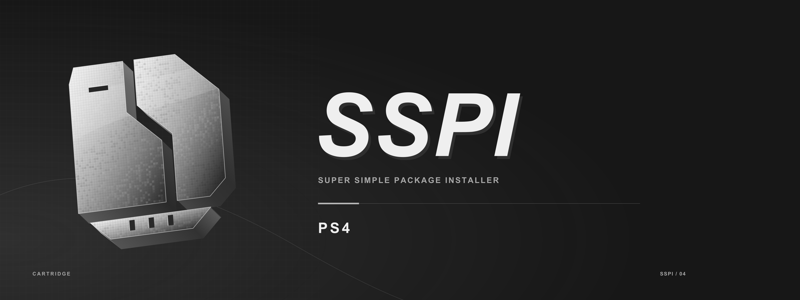

# SSPI PS4

Super Simple Package Installer is a package manager for homebrew-enabled PlayStation 4 consoles. It searches package sources, manages downloads and installs content from a controller-friendly interface.

This repository is a source overview, so you can see what SSPI does on your console. It isn't complete enough to compile: builds from source are reserved for close collaborators. To use SSPI, install the PKG from the releases page.

Current release: [5.11.5 beta](https://github.com/Xyhlo/SSPI/releases/tag/v5.11.5), build `cd56d53dc0d1`.

[Releases](https://github.com/Xyhlo/SSPI/releases) · [Guide](https://xyhlo.github.io/SSPI/) · [Discord](https://discord.gg/hF2vw7ybRs) · [Issues](https://github.com/Xyhlo/SSPI/issues)

## Features

- Search installed package sources by title or CUSA ID, with grouped regions and source variants.
- Install shared sources from the community directory. Installed community sources update themselves in the background.
- Real-Debrid, TorBox, AllDebrid and Premiumize support. Each service requires your own account.
- Queue direct links, stored debrid files and packages or archives from USB.
- Background download, extraction and installation through a resident worker.
- RAR, ZIP and 7z extraction, including multipart and password-protected RAR archives and archives packed inside a RAR.
- FTP inbox installs, RAR sets from USB and multi-part RAR links from your phone.
- A phone page that follows the download queue, including extraction, and can pause, resume, retry, install or remove downloads.
- An installed-game library with custom case covers and home-screen icons, plus photo and pixel backgrounds for SSPI.
- PS4 system theme installs (needs a PS4 test).
- Adaptive download connections and in-app recovery for unresponsive download links.
- Staging on internal storage or an exFAT USB drive.
- Base, update and DLC ordering, with update detection for installed games. DLC published under a sister edition is accepted when the installed game lists that edition (needs a PS4 test).

See the [guide](https://xyhlo.github.io/SSPI/) for setup, storage and download details.

## Requirements

- A PS4 running GoldHEN.
- Free storage for downloaded archives, extracted packages and installed content.
- An account with a supported service for hosted files.

## Installation

1. Download [`sspi5.11.5.pkg`](https://github.com/Xyhlo/SSPI/releases/tag/v5.11.5) from the 5.11.5 beta release. GitHub source archives are not installable packages.
2. Check its SHA-256. On Windows, run `certutil -hashfile sspi5.11.5.pkg SHA256` and compare the result with `ab3f0c4a47ac405782449a1cb468ff5f9e468973201b7c69bbfa8f07dc1d47bc`.
3. Install it over the existing app. Launch SSPI once, fully restart the PS4, enable GoldHEN again and reopen SSPI.
4. The footer should read `BETA 5.11 / cd56d53dc0d1`. Every 5.11 beta has the same app version, so if the footer still shows an earlier build, delete SSPI from the home screen and install the package again. Settings, service keys and the download queue are stored under `/data/SSPI` and are kept.
5. There is no in-app updater, so install updates manually from the release page.

## Setup

1. Open **Settings → Connections** and scan the pairing QR code with a phone on the same network. Save your service keys and enable the services you want to use.
2. Open **Settings → Connections → Manage sources**. Choose **Browse community sources** to install a shared source, then enable the sources you want to use.
3. Use **PS4 Settings** to choose where games install. In SSPI, use **Settings → Storage → Staging location** for temporary download and extraction files. Keep a selected USB drive connected until installation finishes.

Runtime data is stored under `/data/SSPI`. Settings and service keys stay on the console.

## Controls

| Button | Action |
| --- | --- |
| D-pad | Move focus or adjust a value |
| Cross | Open, select or run the displayed action |
| Circle | Back or close |
| L1 / R1 | Switch tabs or settings pages |
| Options | Open or close settings |
| Square | Selection, cancellation or removal |
| Triangle | Expand mirrors or refresh |
| L2 | Change region in details, close the Downloads drawer or cycle queue filters |
| R2 | Open the Downloads drawer or filter update versions |
| Touchpad | Open the installed-game **Library** from Search, or **My files** from Downloads |

The action row at the bottom of each screen shows the current bindings.

## Reporting problems

Open an [issue](https://github.com/Xyhlo/SSPI/issues) with:

- The version and build ID from the footer
- Console model and firmware
- Package type and the stage that failed (download, extraction or installation)
- The full error message and steps to reproduce
- Relevant entries from `/data/SSPI/logs/combined.log`

Remove service keys, pairing tokens and signed download URLs before sharing logs or screenshots.

## Source

This repository is a source overview, not a buildable project. It shows how SSPI searches sources, works with link services, and downloads, extracts and installs packages, so you can review what runs on your console.

Some parts are deliberately left out so that SSPI can't be compiled or repackaged from this repository: the project files, the application identity, the native runtime loader and the background service's loader code. SDKs, build tooling, runtime assets and tests are not included either. Builds from source are reserved for close collaborators, so install SSPI from the releases page.

| Path | Contents |
| --- | --- |
| `app/` | Application, interface, sources, services and pairing |
| `native/` | Startup, cover decoding and video |
| `transfer/` | Native download engine |
| `https/` | HTTP range helpers |
| `resident/` | Background queue, archive and installation code |

## License

Original SSPI code is released under the [MIT license](LICENSE). Third-party source keeps its own notices; see [THIRD_PARTY_NOTICES.md](THIRD_PARTY_NOTICES.md).
